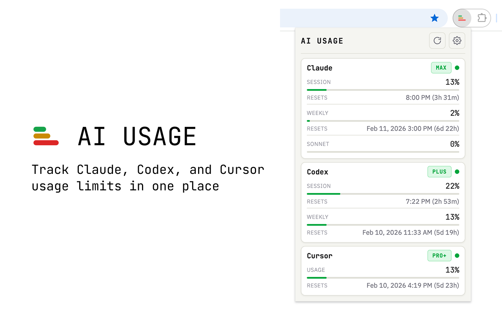

# AI Usage

Chrome extension that tracks usage limits across Claude, Codex, and Cursor in a unified dashboard.



## Features

- **Unified dashboard** — View all AI service limits in one place
- **Visual progress bars** — Color-coded thresholds (warning at 50%, danger at 80%)
- **Reset countdowns** — See when your limits refresh
- **Provider details** — Claude overage spend, Codex credits, Cursor on-demand spend and legacy request counts
- **Customizable** — Reorder providers, toggle visibility, dark/light theme
- **Privacy-focused** — No external servers, data stays in your browser

## Supported Providers

- Claude ([claude.ai](https://claude.ai))
- Codex ([chatgpt.com](https://chatgpt.com))
- Cursor ([cursor.com](https://cursor.com)) — legacy accounts show request counts instead of spend

## Usage

1. Log into the AI services you want to track ([claude.ai](https://claude.ai), [chatgpt.com](https://chatgpt.com), [cursor.com](https://cursor.com))
2. Click the extension icon in Chrome toolbar
3. Your usage data appears automatically

The extension reads your existing session cookies — no additional login required.

## How It Works

The extension reads session cookies from each provider's domain, fetches usage data directly from their APIs, and caches results locally (60s TTL). If a fetch fails, cached data is shown with a staleness notice. No data leaves your browser.

## Installation

### Chrome Web Store

<!-- TODO: Add store link when published -->

Coming soon.

### Manual Install

Requires [Bun](https://bun.sh).

1. Clone/download this repo
2. Run `bun install && bun run build`
3. Open `chrome://extensions` → Enable "Developer mode"
4. Click "Load unpacked" → Select the `dist/` folder

## Development

Requires [Bun](https://bun.sh).

`bun run dev` rebuilds on changes and updates `dist/dev-reload.json`. The service worker polls that file and calls `chrome.runtime.reload()` so the extension reloads automatically. Load `dist/` as an unpacked extension and keep `bun run dev` running.

```bash
bun install            # Install dependencies
bun run dev            # Build with watch + auto-reload
bun run build          # Production build to dist/
bun test               # Run tests
bun test --coverage    # Run tests with coverage
bun run lint           # ESLint check
bun run lint:fix       # ESLint autofix
bun run format         # Prettier format all
bun run format:check   # Check formatting
```

## License

MIT
